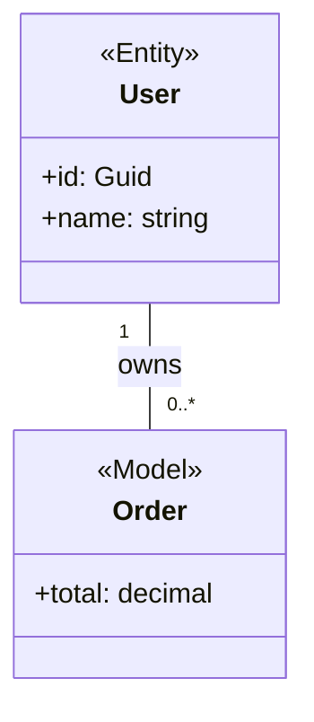

# AutoDiagram

AutoDiagram is an open-source diagram generation and layout engine focused on converting structured software architecture input into editable UML diagrams for draw.io / diagrams.net.

The project converts Mermaid `classDiagram` input into deterministic draw.io `mxGraphModel` XML while preserving semantic UML structure, deterministic layout behavior, and editable routing metadata.

AutoDiagram is designed as a long-term foundation for:

```text
source code / architecture metadata
    ↓
semantic intermediate model
    ↓
deterministic layout + routing
    ↓
editable UML diagrams
```

The current implementation focuses primarily on UML class diagrams.

---

# Vision

AutoDiagram is intended to become a reusable infrastructure layer for architecture visualization and semantic diagram generation.

Future target diagram types include:

* UML class diagrams
* sequence diagrams
* component diagrams
* entity relationship diagrams
* infrastructure topology diagrams
* architecture dependency graphs
* bounded-context maps

The long-term goal is to support:

```text
raw source code
→ semantic extraction
→ knowledge graph
→ deterministic diagram generation
```

However, generalized semantic extraction and knowledge-graph generation are not implemented yet.

---

# Current Input Model

AutoDiagram currently requires structured input.

The engine does not yet perform full semantic understanding of arbitrary codebases.

The supported production input format is currently:

* Mermaid `classDiagram`

Current workflow:

```text
codebase
→ structured semantic representation
→ AutoDiagram
```

rather than:

```text
raw source code
→ automatic semantic understanding
→ diagram
```

The architecture intentionally separates:

* parsing
* semantic modeling
* layout
* routing
* export

This separation allows future language parsers and semantic extractors to be added without rewriting routing or export systems.

---

# Core Pipeline

```text
Mermaid classDiagram
    ↓
Parser
    ↓
DiagramDocument (semantic model)
    ↓
Layout engine
    ↓
Routing engine
    ↓
mxGraphModel XML exporter
    ↓
.drawio / raw XML
```

---

# Project Goals

The project is built around several core principles:

* deterministic output from identical semantic input
* semantic UML preserved independently from layout state
* editable layout intent without modifying UML semantics
* orthogonal routing with readable connector topology
* stable draw.io-compatible output
* client-side execution without backend dependency
* explicit diagnostics and validation
* reproducible regression testing

The system is optimized for:

* layered enterprise architectures
* DTO/service/controller flows
* dependency-heavy systems
* dense UML relationship graphs
* architecture documentation pipelines

---

# Main Components

## Mermaid Parser

Parses Mermaid `classDiagram` input into a semantic `DiagramDocument`.

The parser extracts:

* classes
* stereotypes
* attributes
* methods
* constructors
* relationships
* multiplicities
* relationship labels

The parser does not generate layout geometry.

---

## Layout Engine

The layout engine computes:

* stereotype group placement
* per-class synthetic groups for classes without stereotypes
* node placement
* node sizing
* packing direction
* anchor assignment
* routing metadata
* layout diagnostics
* score metrics

The layout system supports deterministic candidate generation and scored layout selection.

---

## Routing Engine

Routing-v2 is the current advanced orthogonal routing system.

Features include:

* deterministic anchor slots
* corridor routing
* outer-lane routing
* routing dividers
* sparse lane-graph recovery
* local route repair
* overlap validation
* crossing diagnostics
* hard validation reporting

The router prioritizes:

```text
semantic correctness
→ node avoidance
→ edge identity preservation
→ crossing reduction
→ compactness
```

---

## Routing Dividers

Dense fan-in and fan-out relationships may be expanded into routing divider graphs.

Example:

```text
A → B1
A → B2
A → B3
A → B4
```

becomes:

```text
A → divider → B1/B2/B3/B4
```

Dividers:

* participate in routing occupancy
* behave as routing obstacles
* preserve semantic relationships
* reduce connector congestion
* remain deterministic

Dividers are routing primitives, not post-processing decorations. Auto layout v2 scores generated group-placement candidates before routing dividers are materialized, so divider rectangles do not influence greedy group placement or selected candidate choice. The final routing pass then adds dividers as connector-graph nodes: for each remote group, the first divider uses the side facing the common endpoint, the second uses the opposite side, and additional dividers emit `divider-side-overflow` while using bounded best-effort side and offset search.

---

## Draw.io Exporter

Exports raw `mxGraphModel` XML.

Features include:

* UML swimlane class rendering
* orthogonal routed edges
* explicit anchor positions
* waypoint serialization
* multiplicity edge labels
* deterministic cell IDs
* optional stereotype group frames

Example generated IDs:

```text
node_1
edge_3
group_frame_2
divider_1
```

The exporter intentionally avoids:

* compressed `.drawio` blobs
* `<mxfile>` wrappers
* exporter-side rerouting

Routing ownership belongs to the routing engine.

---

## Web UI

The web UI is a React + Vite editor built directly on the AutoDiagram engine.

The editable source of truth is the `mxGraphModel`.

Features include:

* Mermaid editing
* XML import/export
* layout intent editing
* orthogonal edge editing
* terminal reconnection
* group placement editing
* zoom/pan
* undo/redo
* SVG preview
* diagnostics panel
* routing score display

The web UI intentionally does not embed the official draw.io editor.

---

# Repository Structure

```text
packages/
  core/          Shared semantic + layout types
  parser/        Mermaid parser
  layout/        Layout and routing engines
  drawio/        mxGraphModel exporter

apps/
  web/           React + Vite editor

scripts/
  autodiagram_standalone.py

docs/
  demo_mermaid.md

tests/
  fixtures/
```

---

# Supported Mermaid Subset

Supported syntax includes:

* `classDiagram`
* `class Name { ... }`
* stereotypes
* attributes
* methods
* constructors
* return types
* multiplicities
* relationship labels

Supported relationship operators:

```text
--
-->
<--
..
..>
<..
<|..
..|>
<|--
--|>
o--
--o
*--
--*
```

Example:



---

# Layout Intent

The engine separates semantic UML from layout intent.

Layout intent controls:

* group placement
* packing direction
* node ordering
* routing preferences

Semantic UML remains unchanged.

Example workflow:

```bash
npm run layout:init -- docs/demo_mermaid.md -o out/demo.layout.json

npm run generate -- docs/demo_mermaid.md -o out/demo.drawio --layout out/demo.layout.json
```

---

# Open Source Packages

AutoDiagram exposes reusable npm packages.

Example installation:

```bash
npm install @autodiagram/core
npm install @autodiagram/parser-mermaid
npm install @autodiagram/layout
npm install @autodiagram/export-drawio
```

Example usage:

```ts
import { parseMermaidClassDiagram } from "@autodiagram/parser-mermaid";
import { generateLayout } from "@autodiagram/layout";
import { exportDrawioXml } from "@autodiagram/export-drawio";

const document = parseMermaidClassDiagram(input);
const layout = generateLayout(document);

const xml = exportDrawioXml(layout);
```

CLI installation:

```bash
npm install -g @autodiagram/cli
```

CLI usage:

```bash
autodiagram generate input.mmd -o output.drawio
```

---

# Commands

## Install

```bash
npm install
```

---

## Build

```bash
npm run build
```

---

## Run Tests

```bash
npm test
```

Python regression tests:

```bash
npm run test:python
```

---

## Start Web UI

```bash
npm run web:dev
```

Build production web bundle:

```bash
npm run web:build
```

---

## Generate Diagram

```bash
npm run generate -- docs/demo_mermaid.md -o out/demo.drawio
```

---

## Create Layout Intent

```bash
npm run layout:init -- docs/demo_mermaid.md -o out/demo.layout.json
```

---

## Generate Using Layout Intent

```bash
npm run generate -- docs/demo_mermaid.md -o out/demo.drawio --layout out/demo.layout.json
```

---

## Generate With Group Frames

```bash
npm run generate \
  -- docs/demo_mermaid.md \
  -o out/demo.drawio \
  --group-frames
```

---

## Routing V2

```bash
npm run layout:init \
  -- docs/demo_mermaid.md \
  -o out/demo.routing-v3.json \
  --engine v2

npm run generate \
  -- docs/demo_mermaid.md \
  -o out/demo-v2.drawio \
  --layout out/demo.routing-v3.json \
  --engine v2
```

Routing-v2 layout JSON may also include root-level `layers`. When `layers` is present, the engine measures each group with its current `packing` and `nodeOrder`, places groups into horizontal centered layer rows, and then runs routing. Without `layers`, v2 keeps the explicit group `x/y` coordinates.

```json
{
  "version": 3,
  "layoutMode": "coordinate-routing",
  "layers": [
    { "id": "api", "groupIds": ["group_stereotype_Controller"] },
    { "id": "domain", "groupIds": ["group_stereotype_Manager", "group_stereotype_Model"] }
  ],
  "groups": []
}
```

The web manual layout wizard can export a CLI-ready routing-v3 intent JSON that preserves `layers`, group packing, node order, and routing options.

---

# Standalone Python Pipeline

The repository includes a standalone Python routing-v2 implementation:

```text
scripts/autodiagram_standalone.py
```

Requirements:

* Python 3.10+
* standard library only

Pipeline:

```text
Mermaid
→ semantic model
→ routing-v2 layout
→ mxGraphModel XML
```

The Python pipeline is intended for:

* regression testing
* portable generation
* offline routing experiments
* algorithm prototyping

It is not intended as a backend service.

---

# Diagnostics

Routing-v2 exposes structured diagnostics and validation data.

Examples:

* edge crossings
* node hits
* routing failures
* divider overflow
* illegal segment overlaps
* repair counts

Diagnostics are exposed through:

* CLI reports
* JSON reports
* web UI layout state

Recommended architecture:

```text
Diagnostics = stable product data
Trace events = debug timeline
```

---

# Versioning Policy

AutoDiagram follows Semantic Versioning:

```text
MAJOR.MINOR.PATCH
```

Rules:

* MAJOR:
  breaking API or intermediate model changes
* MINOR:
  backward-compatible features
* PATCH:
  bug fixes and deterministic behavior fixes

Routing score changes that alter generated topology should be treated as MINOR changes.

Intermediate model schema changes must include migration notes.

---

# Naming Conventions

## TypeScript Types

Use PascalCase:

```ts
DiagramDocument
RoutingCandidate
LayoutDiagnostics
```

---

## Functions

Use camelCase:

```ts
generateLayout()
routeConnectorGraph()
exportDrawioXml()
```

---

## Constants

Use SCREAMING_SNAKE_CASE only for immutable constants:

```ts
MAX_ROUTE_REPAIR_ITERATIONS
DEFAULT_GROUP_PADDING
```

---

## Files

Use:

```text
kebab-case.ts
```

Examples:

```text
template-router.ts
drawio-exporter.ts
routing-diagnostics.ts
```

Avoid:

```text
TemplateRouter.ts
drawIOExporter.ts
```

---

# Routing Terminology Rules

Use consistent terminology across the repository.

Preferred terms:

| Preferred          | Avoid         |
| ------------------ | ------------- |
| semantic edge      | original edge |
| physical connector | rendered edge |
| divider            | split node    |
| waypoint           | bend point    |
| route repair       | cleanup       |
| hard validation    | strict mode   |

Routing-v2 internally distinguishes:

```text
semantic relationships
vs
physical routed segments
```

---

# Determinism Requirements

Deterministic output is a core architectural constraint.

The following are prohibited unless explicitly documented:

* random layout placement
* unstable iteration ordering
* nondeterministic hash iteration
* timestamp-derived IDs
* UUID-based exported IDs

Allowed:

```text
node_1
edge_7
divider_2
```

Disallowed:

```text
550e8400-e29b-41d4-a716-446655440000
```

---

# Public API Rules

Public packages should expose stable entry points.

Preferred:

```ts
@autodiagram/layout
@autodiagram/core
```

Avoid deep imports:

```ts
@autodiagram/layout/src/internal/router
```

Internal routing implementations may change between minor versions.

---

# Intermediate Model Stability

`DiagramDocument` is the primary semantic contract.

Layout and export systems should treat it as immutable semantic input.

Routing metadata belongs in:

```text
document.layout
```

rather than semantic node definitions.

The architecture intentionally separates:

```text
semantic state
vs
layout state
vs
export state
```

---

# Testing Requirements

All routing and layout contributions should include:

* deterministic regression tests
* routing validation tests
* export compatibility tests
* overlap/crossing assertions
* fixture diagrams

Routing fixes should include:

```text
input
→ expected diagnostics
→ expected hard-validation state
```

rather than relying only on screenshot comparison.

---

# Known Limits

* No compressed `.drawio` export
* No `<mxfile>` wrapper
* No free-form shape editing
* No continuous global optimizer
* SVG export is preview-only
* draw.io editor embedding is intentionally out of scope
* standalone Python output is behaviorally compatible, not byte-identical
* no generalized code knowledge graph yet
* Mermaid is currently the only production-supported structured input

---

# Future Direction

Planned future work includes:

* source-code semantic extraction
* knowledge graph generation
* language-specific adapters
* incremental layout updates
* collaborative editing
* additional UML diagram types
* graph database integration
* LLM-assisted semantic enrichment
* architecture rule validation

Long-term target architecture:

```text
codebase
→ semantic graph
→ architecture model
→ deterministic diagram generation
→ editable visual workspace
```

while preserving deterministic routing behavior and stable export semantics.

---

# Output Philosophy

AutoDiagram prioritizes:

```text
Readable UML
over
minimum edge length

Deterministic routing
over
aggressive auto-layout mutation

Semantic preservation
over
visual post-processing
```
