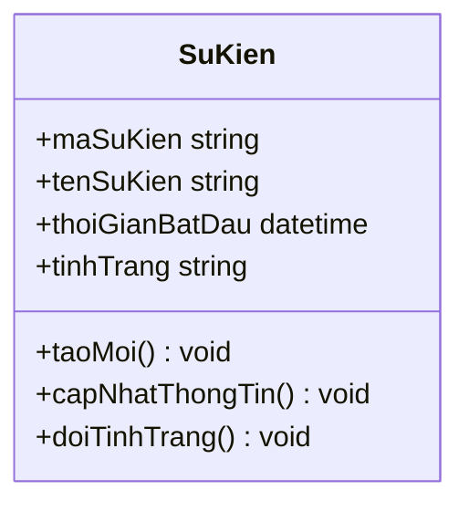
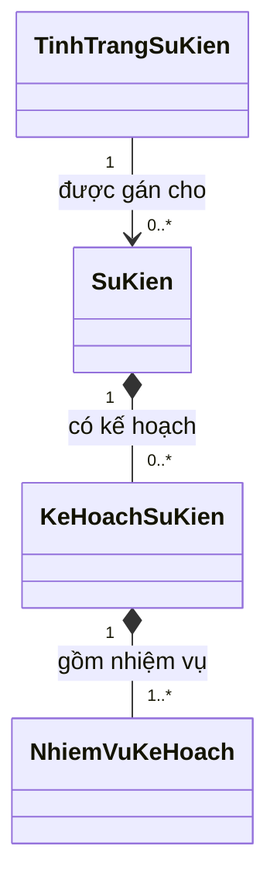

# Business Class Diagram Mermaid

## Workflow

1. Confirm the requested scope: overview, one business group, one workflow, one aggregate, or appendix diagram.
2. Read the provided business sources before code. Prefer approved B1/B2/B3/B4/B5 tables, use cases, SRS, business flows, and screen descriptions.
3. Use code only as evidence that a business object exists. Do not turn controllers, services, DTOs, helpers, generated relation classes, or persistence plumbing into business classes.
4. Select only classes that have stable business meaning and are needed for the requested diagram. Split the diagram when it would exceed about 20 classes.
5. Write Mermaid `classDiagram` with stable ASCII class IDs, Vietnamese business attributes, Vietnamese business operations, and short Vietnamese relationship labels.
6. Validate Mermaid syntax and business scope before answering.

## Source Priority

Use sources in this order for business-level diagrams:

1. User-approved business class lists such as B1/B2/B3/B4/B5 tables.
2. Use cases, SRS, business flows, screen descriptions, and Mẫu 08/TKPM documents.
3. Controller/entity/source code only as evidence that a business object exists.
4. Existing Mermaid diagrams only as reference, not source of truth, unless the user explicitly says to reuse them.

Do not invent a business class solely because a DTO, request, response, helper, mapper, generated relation class, or technical payload exists.

## Business Scope

A business-level class diagram describes business objects managed by the system, not implementation classes.

For Mẫu 08/TKPM, valid business objects include:

- đối tượng nghiệp vụ chính;
- danh mục hoặc dữ liệu nền;
- chi tiết nghiệp vụ;
- dữ liệu liên kết;
- dữ liệu lịch sử hoặc trạng thái;
- dữ liệu không gian;
- tệp hoặc hồ sơ;
- dữ liệu tổng hợp hoặc tích hợp when meaningful to the business flow.

Exclude these from business-level diagrams unless the user explicitly asks for implementation-level diagrams:

- Controller;
- Manager or Service;
- Repository or Adapter;
- LLBLGen or DataAccess generated classes;
- DTO, Request, Response, ViewModel;
- Mapper, Helper;
- cache or token payload;
- frontend component.

If implementation mapping is needed, describe it outside the business diagram in a short note or mapping table.

## Class Inclusion

Include a class only when at least one condition is true:

- It is a main object in a use case or business workflow.
- It has create, view, update, delete, search, approve, evaluate, report, or export behavior.
- It has its own lifecycle or state.
- It is a child/detail object owned by a parent business object.
- It is a reference/catalog object required to understand a business object.
- It is a history/audit object required to understand approval, rejection, state change, or processing flow.
- It is a GIS/spatial object required to understand map-based operations.
- It is a file/document object required to understand business records.
- It is a summary/integration object explicitly approved by the user.

Move a class to notes, appendix, or omit it when it is technical plumbing, has no stable business meaning, is weakly inferred, or makes the diagram harder to read.

## Diagram Split Rules

Do not put all business classes into one diagram for a large system.

- Ideal size: 8 to 15 classes.
- Hard limit: about 20 classes.
- Split by business group, workflow, aggregate, or bounded context when needed.
- The overview diagram should show only core business classes and high-value relationships.
- Put detailed catalog, GIS, file, configuration, dashboard, and integration classes in group or appendix diagrams.

Recommended split patterns:

- Tổng quan hệ thống;
- Đăng nhập và phân quyền;
- Danh mục nguồn lực;
- Quản lý sự kiện;
- Kế hoạch sự kiện;
- Kế hoạch nhân lực và phương án địa phương;
- Bố trí đối tượng tác chiến và bản đồ bố trí;
- Bản đồ số và dữ liệu không gian;
- Giám sát, cảnh báo, dashboard;
- Báo cáo, xử lý, đánh giá, kết thúc sự kiện;
- Tệp, hồ sơ, cấu hình và dữ liệu phụ trợ.

If the source has a “Có đưa vào sơ đồ chính không” or similar flag:

- include `Có` classes in main or group diagrams;
- include `Phụ lục` classes only in appendix or supporting group diagrams;
- omit `Không` classes from the Mermaid and mention them only when relevant.

## No Stereotypes

Do not use UML or Mermaid stereotype syntax in business-level class diagrams.

This applies to all class categories, including core business objects, catalogs, details, links, history, GIS, files, configuration, summary, integration, implementation classes, and DTO-like concepts.

If the class category matters, express it outside the class body in a short note after the Mermaid block, or make it clear through diagram grouping and surrounding text. Never place category markers inside a Mermaid class body.

## Naming and Class Content

Use stable ASCII class IDs in Mermaid, for example:

- `SuKien`
- `KeHoachSuKien`
- `NhuCauNhanLuc`
- `BoTriDoiTuong`

Use Vietnamese business terms for relationship labels, attributes, operations, and notes. Keep display names with accents in notes unless Mermaid labels are clearly safe.

Preferred form:

## Attribute Rules

Include only business attributes that clarify the object.

Prioritize:

- identifiers such as `ma...`, `so...`;
- names or titles such as `ten...`, `tieuDe`;
- classification/type fields such as `loai...`;
- lifecycle/state fields such as `trangThai`, `tinhTrang`;
- ownership/unit fields such as `donVi`, `nguoiLap`, `nguoiDuyet`;
- workflow time fields such as `thoiGianBatDau`, `ngayLap`, `ngayDuyet`;
- location/spatial fields such as `viTri`, `toaDo`, `shape`;
- relationship-carrying attributes such as `suKien`, `keHoach`, `nhiemVu`;
- summary fields only when meaningful to the business view.

Avoid database IDs when a business code is available, audit fields unless they matter to workflow, technical flags, ORM relation helper fields, raw foreign-key names, generated collection names, cache fields, and token internals.

Recommended counts:

- important business class: 5 to 12 attributes;
- secondary/reference class: 3 to 8 attributes;
- summary/integration class: only fields needed to explain the view.

## Operation Rules

Operations are business behaviors, not code methods.

Prefer names such as:

- `xemDanhSach()`
- `timKiem()`
- `xemChiTiet()`
- `taoMoi()`
- `capNhatThongTin()`
- `xoa()`
- `trinhDuyet()`
- `pheDuyet()`
- `tuChoi()`
- `huy()`
- `doiTrangThai()`
- `ghiNhanLichSu()`
- `boTriNguonLuc()`
- `capNhatViTriBanDo()`
- `tongHopDuLieu()`
- `xuatBaoCao()`

Avoid getters/setters, controller actions copied literally, repository/adapter methods, ORM save/fetch/delete helpers, mapper methods, and validation helpers unless they are business rules.

Recommended counts:

- important business class: 3 to 6 operations;
- secondary class: 1 to 4 operations;
- pure reference class: CRUD/status operations only if useful.

## Relationship Rules

Show only durable business relationships.

Use these Mermaid relationship types consistently:

- Association: `A -- B`. No arrow. `A` and `B` have a stable relationship without emphasizing navigability or ownership.
- Directed association: `A --> B`. Arrow from `A` to `B`. `A` knows, references, or directly uses `B`; `A` does not own `B`'s lifecycle.
- Aggregation: `A o-- B`. Empty diamond at `A`. `A` is the whole and `B` is a part, but `B` can exist independently.
- Composition: `A *-- B`. Filled diamond at `A`. `A` strongly owns `B`; `B`'s lifecycle depends on `A`.
- Inheritance / Generalization: `A <|-- B`. Hollow triangle points to `A`. `B` inherits from `A`; `A` is the parent class and `B` is the child class.
- Realization / Implements: `A <|.. B`. Hollow triangle points to `A`. `B` realizes `A`; usually `A` is an interface and `B` is the implementing class.
- Dependency: `A ..> B`. Dashed arrow from `A` to `B`. `A` temporarily depends on `B`, for example through a parameter, local variable, calculation, report, or external call.

Use composition `*--` when a child object is lifecycle-owned by a parent and removing the parent normally removes or invalidates the child in business terms.

Examples:

- `SuKien *-- SoDoSuKien`
- `KeHoachSuKien *-- NhiemVuKeHoach`
- `KeHoachNhanLuc *-- NhuCauNhanLuc`
- `BaoCaoSuCo *-- XuLySuCo`

Use directed association `-->` when one object references another but does not own its lifecycle.

Examples:

- `SuKien --> TinhTrangSuKien`
- `LucLuong --> LoaiLucLuong`
- `BoTriDoiTuong --> LucLuong`
- `DiemBoTriBanDo --> IconTacChien`

Use plain association `--` when the business relationship is durable but the diagram should not imply navigability or direction.

Use aggregation `o--` sparingly, only for clear shared whole-part relationships without lifecycle ownership.

Use inheritance `<|--` and realization `<|..` only when the source explicitly supports a business-level generalization or interface-like contract. Do not add implementation inheritance or service/interface relationships to a business-level diagram.

Use dependency `..>` only when the relationship is temporary, derived, integration-related, summary-related, dashboard-related, inferred, or display-only.

Do not show DTO dependencies, controller-manager calls, database helper relationships, implementation interface relationships, or weak inferred relationships in the main diagram.

## Multiplicity

Use business multiplicity when known or strongly implied: `1`, `0..1`, `0..*`, `1..*`.

If uncertain, use conservative multiplicity and add a short note after the Mermaid block.

Example:

## Output Rules

When asked to draw a business-level class diagram:

1. Return Mermaid only for the requested diagram or group.
2. Do not include A/B planning tables unless asked.
3. After Mermaid, include only important assumptions, relationships or multiplicities needing confirmation, and omitted classes with reasons.
4. Do not include long explanations or UML tutorials.

## Validation Checklist

Before returning the Mermaid diagram, verify:

- the diagram uses business classes, not implementation classes;
- DTO, Request, Response, ViewModel, Helper, Mapper, cache/token payload, and frontend components are absent;
- Controller, Manager/Service, Repository/Adapter, and LLBLGen/DataAccess classes are absent unless the user explicitly requested implementation mapping;
- no stereotype syntax appears in class bodies;
- each class has clear business meaning;
- each relationship is meaningful at business level;
- the diagram has no more than about 20 classes;
- important parent-child chains are visible;
- reference/catalog classes are near the classes using them;
- audit/history classes are near the classes they record;
- weak or uncertain relationships are moved to notes or appendix;
- Mermaid syntax is valid.
