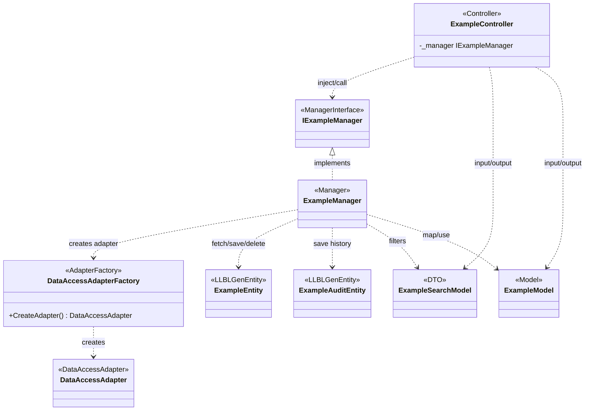
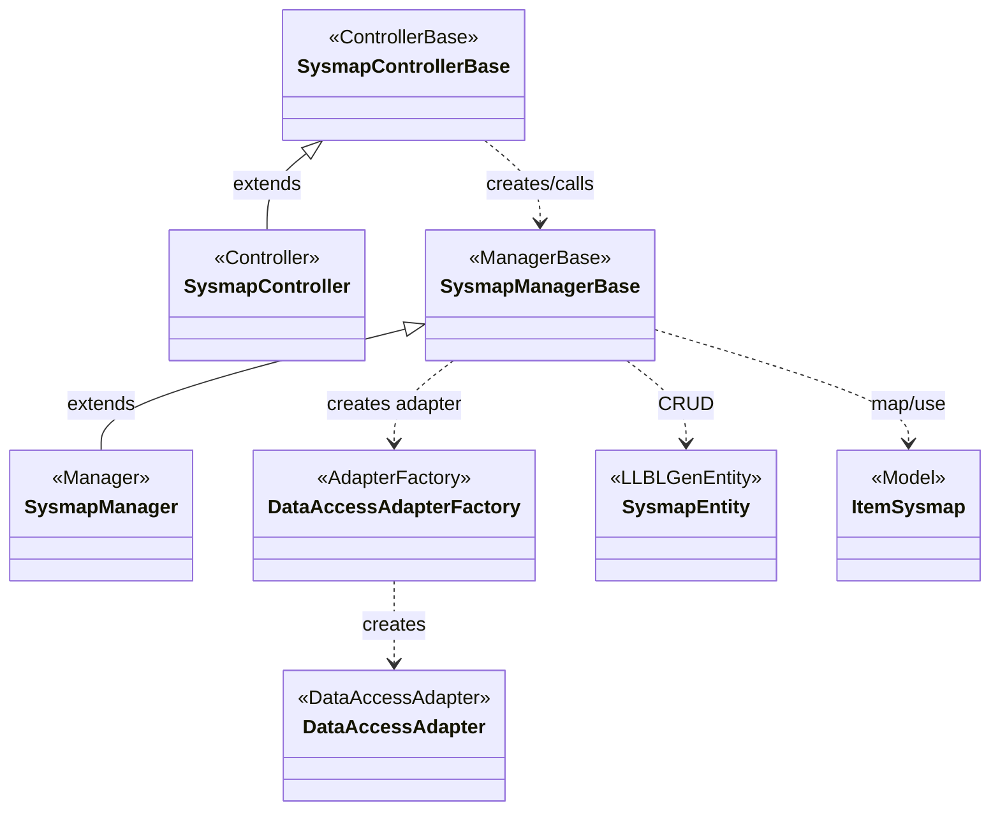
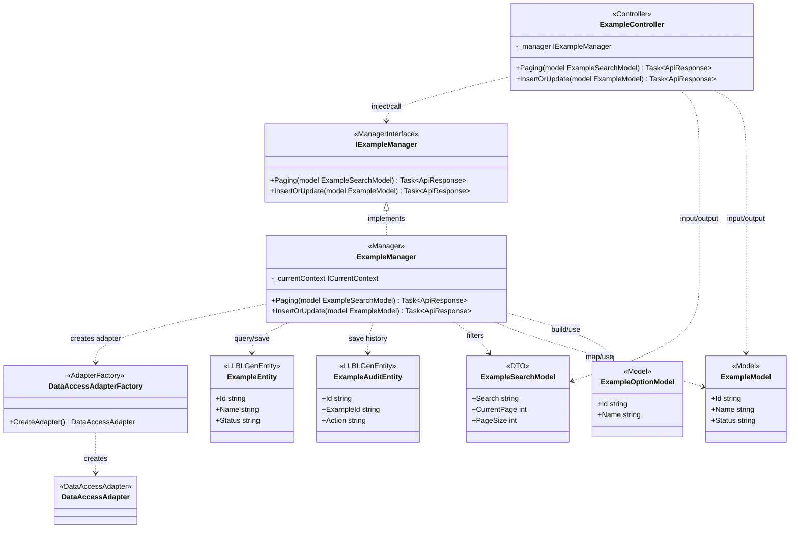

# Class Diagram Mermaid

## Default Scope

Draw logical implementation class diagrams from code evidence for exactly one concrete controller or manager class.

Required input:

- The user should provide one concrete `Controller`, `ControllerBase`, `Manager`, or `ManagerBase` class name.
- If the user provides only a broad module/domain name, search candidate controllers/managers and ask the user to choose one before drawing.
- Do not draw package/module overviews by default. If a broad overview is explicitly requested, split it into separate diagrams per concrete controller/manager.

Default architecture for the BCA/QTHT/GIS codebases:

```text
Controller -> Manager / ManagerBase -> DataAccessAdapterFactory / DataAccessAdapter -> LLBLGen Entity
```

Vietnamese wording:

```text
Lớp tiếp nhận yêu cầu -> Lớp xử lý nghiệp vụ -> Lớp truy cập dữ liệu -> Lớp dữ liệu sinh bởi LLBLGen
```

Do not model these codebases as BCE unless the user explicitly asks for a BCE exercise. Do not use `<<Boundary>>`, `<<Control>>`, or BCE-style `<<Entity>>` for these repos.

## Workflow

1. Establish the requested concrete class before drawing: exactly one controller/controller base or one manager/manager base. If only a module is provided, find candidate classes and ask the user to choose one.
2. Read the relevant source artifacts. Prefer actual files over inferred names: the selected class, directly injected/called manager interface and implementation, direct controller caller when the selected class is a manager, adapter factories, `DataAccessAdapter`, directly manipulated LLBLGen entity classes, DTO/model files, DI registration, and direct method calls.
3. Include the full direct implementation surface for the selected class: directly connected controller/manager/interface/base classes, adapter classes, directly manipulated LLBLGen entities, and every DTO/model class used by the selected controller or manager.
4. Include LLBLGen entities only when the selected controller or manager directly fetches, saves, deletes, queries, maps, or uses their fields/navigators. Do not include entities that are only indirectly related through database FKs unless the selected class touches them.
5. Use the real class, interface, enum, DTO/model, method, and property names exactly as found in source. For nested DTO/model classes, use a stable Mermaid ID and label such as `SysQlpaModel_LoaiLucLuongOptionModel["SysQlpaModel.LoaiLucLuongOptionModel"]`.
6. Model classes with Mermaid class compartments when useful: stereotype, key attributes/dependencies, and operations/properties required by the rules below. Omit empty compartments.
7. Validate Mermaid syntax before answering: class IDs avoid spaces, operations contain `()`, generics use `~T~`, relation labels follow the relation, and comments use `%%`.

## Source Fidelity

- Include a class only when it appears in supplied text, file paths, source code, code search results, entity/model files, API/controller files, DI registration, or explicit user artifacts.
- Search the codebase when names are uncertain. If still not found, state the source gap outside the diagram.
- Do not invent frontend, boundary, service, repository, adapter, entity, DTO, enum, field, or operation classes.
- Do not turn every helper, mapper, cache, HTTP client, config wrapper, exception/result wrapper, or logging utility into a class. Include one only when it is central to the requested flow.
- Do not dump all generated LLBLGen code. For LLBLGen entities, include only the fields/navigators directly read, filtered, assigned, saved, deleted, mapped, or used for relationships by the selected controller/manager.
- For DTO/model classes used by the selected controller or manager, include all declared properties of those concrete DTO/model classes unless they are generic wrappers such as `ApiResponse~T~` or `PageModelView~T~`.

## Implementation Stereotypes

Use these stereotypes for logical implementation diagrams:

- `<<Controller>>`: API controller that receives HTTP requests, for example `DmHanhViController`, `QuanLySuKienController`, `SysmapController`.
- `<<ControllerBase>>`: project controller base with implemented endpoints/base flow, for example `SysmapControllerBase`.
- `<<ManagerInterface>>`: manager interface injected into a controller, for example `IDmHanhViManager`, `IQuanLySuKienManager`.
- `<<Manager>>`: manager handling business/application logic, custom flow, validation, orchestration, export, cache invalidation, or direct data access, for example `DmHanhViManager`, `QuanLySuKienManager`, `SysmapManager`.
- `<<ManagerBase>>`: generated or base CRUD-style manager, for example `SysmapManagerBase`.
- `<<AdapterFactory>>`: factory that creates LLBLGen adapters, usually `DataAccessAdapterFactory`.
- `<<DataAccessAdapter>>`: LLBLGen database-specific adapter, usually `DataAccessAdapter`.
- `<<LLBLGenEntity>>`: generated LLBLGen entity class, for example `DmHanhViEntity`, `SysqlskSuKienEntity`, `SysmapEntity`.
- `<<DTO>>`: request/response/search/page/export contract used by controller or manager.
- `<<Model>>`: service model or view model used as input/output or mapping target.
- `<<Enumeration>>`: enum from source when enum literals clarify the flow.
- `<<Helper>>`, `<<Mapper>>`, `<<Cache>>`, `<<HttpClient>>`, `<<ExternalService>>`: only when directly relevant to the requested flow.

## No BCE

For `D:\bca\be_qtht_chung` and `D:\bca\be-bds`, do not describe the implementation as BCE by default.

- Do not map controllers to `<<Boundary>>`.
- Do not map managers/services to `<<Control>>`.
- Do not map LLBLGen entities to BCE `<<Entity>>`.
- Use `<<LLBLGenEntity>>` for generated ORM entities.
- Use `<<ManagerInterface>>`, `<<Manager>>`, and `<<ManagerBase>>` for processing layers.

If the user explicitly requests a BCE/analysis diagram for a separate school assignment, ask them to confirm whether they want a non-code pedagogical BCE view or the actual implementation view.

## Relationship Rules

Use UML relationship types from source evidence:

- Generalization/inheritance `<|--` when a class extends a base class.
- Realization `<|..` when a class implements an interface.
- Composition `*--` only when source or workflow shows lifecycle ownership.
- Aggregation `o--` sparingly for clear shared whole-part relationships.
- Association `-->` for durable object references, fields, navigators, or foreign-key-backed entity relationships when source supports navigability.
- Dependency `..>` for constructor injection, local variables, temporary use, method parameters/returns, adapter usage, mapper calls, DTO/model use, cache use, HTTP calls, and generated helper use.

Default DI flow:



Default generated/base flow:



## Class Content Rules

Controller and controller base:

- Include all injected dependencies and public endpoint methods on the selected controller/controller base.
- Use route/action names when they clarify the flow.
- Omit framework boilerplate, attributes, logging wrappers, and commented-out cache paths unless relevant.

Manager interface:

- Include all public contract methods of the manager interface directly used by the selected controller/manager flow.
- Do not include implementation details.

Manager and manager base:

- Include all public operations of the selected manager/manager base.
- Include important private/internal helper methods when the selected manager calls them and they represent validation, rule checks, mapping, orchestration, export/import, scheduling, or non-trivial data access.
- Include dependencies such as current context, mapper, adapter factory, external service, cache, or file/export library only when relevant.
- Omit trivial constructors, getters/setters, catch/log wrappers, and repeated CRUD plumbing when not needed.

Adapter factory and data adapter:

- Keep them compact. Usually only show `+CreateAdapter()` and a connection/catalog detail if it is important.
- Do not expand LLBLGen adapter internals.

LLBLGen entity:

- Include only fields/navigators directly manipulated by the selected controller or manager: assigned, read, filtered, sorted, saved, deleted, mapped, or used for relationships.
- Include identity/state/classification/ownership/time fields only when the selected class directly uses them.
- Omit constructors, serialization members, static metadata, relation factory boilerplate, field index enums, ORM state/tracking, validator plumbing, and generated `GetRelationInfo...()` methods unless explicitly requested.

DTO/model:

- Include every concrete DTO/model class used by the selected controller or manager in method signatures, local variables, mapping calls, returns, request/response payloads, export/import, or validation.
- Include all declared properties for those concrete DTO/model classes.
- Include nested DTO/model classes when they are directly used. Show the source nesting with a Mermaid label, for example `SysQlpaModel_LoaiLucLuongOptionModel["SysQlpaModel.LoaiLucLuongOptionModel"]`.
- Omit paging wrappers, result wrappers, and generic API wrappers unless they are the requested focus.

## Relationship Multiplicity

- Put multiplicity on both ends only when source supports it through LLBLGen navigators, relation classes, collection properties, nullable reference, foreign key semantics, or clear workflow evidence.
- Use `1`, `0..1`, `0..*`, `1..*`, or a concrete range.
- If multiplicity is inferred from code naming or generated navigators, mention it after the diagram.
- Do not invent composition or multiplicity from table names alone.

## Output

Return Mermaid first, then short notes:



After the code block, list only important assumptions, unresolved multiplicities, and source gaps. Do not add long UML tutorials.

## Mermaid Rules

- Start every diagram with `classDiagram`.
- Prefer stable ASCII class IDs matching source class names.
- Use Mermaid class labels only when display names require spaces or punctuation.
- Use Mermaid relation syntax consistently: `<|--`, `<|..`, `*--`, `o--`, `-->`, `..>`.
- Put the diamond side on the owner/whole: `Whole "1" *-- "0..*" Part : contains`.
- Keep relation labels short and implementation-facing, such as `inject/call`, `implements`, `creates adapter`, `creates`, `fetch/save/delete`, `query`, `map/use`, `input/output`.
- Comments must be on their own line and start with `%%`.

## Reference

When exact UML or Mermaid syntax matters, read `references/uml-mermaid.md`.
