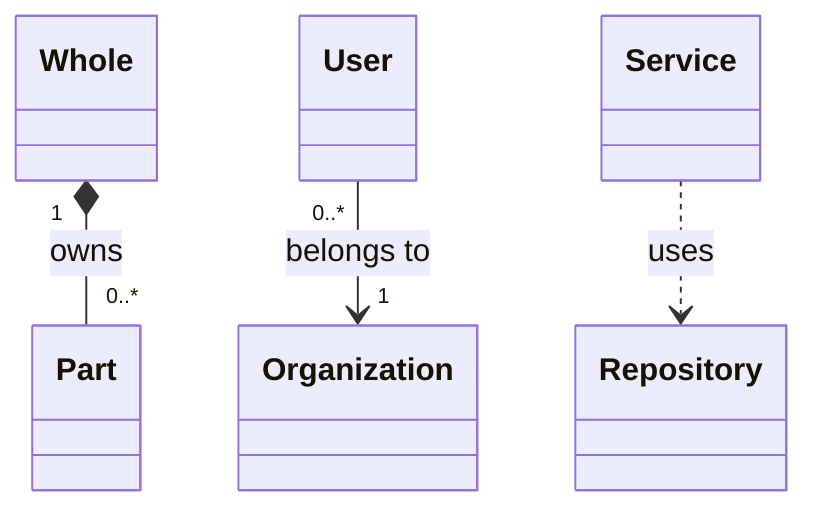
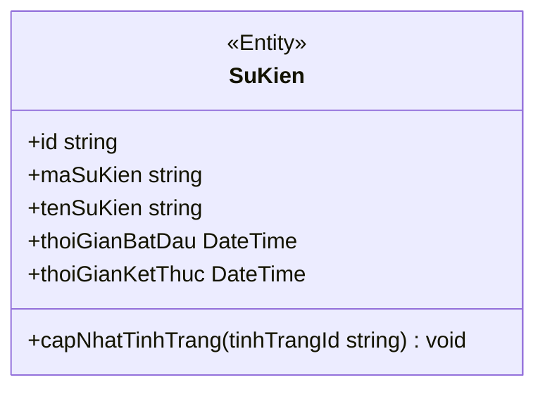

# UML And Mermaid Class Diagram Reference

Use this reference when creating or reviewing Mermaid `classDiagram` output against UML class diagram intent.

## Sources Checked

- ISO/IEC 19501:2005: UML Version 1.4.2, published 2005-04, confirmed as current in the ISO catalogue as of 2026-04-29. https://www.iso.org/standard/32620.html
- ISO/IEC 19505-1:2012: OMG UML revision 2, Part 1 Infrastructure, published 2012-04, confirmed in 2025. https://www.iso.org/standard/32624.html
- ISO/IEC 19505-2:2012: OMG UML revision 2, Part 2 Superstructure, published 2012-04, confirmed in 2025. https://www.iso.org/standard/52854.html
- OMG UML 2.5.1: formal UML specification, adopted December 2017, with normative PDF and machine-readable metamodel files. https://www.omg.org/spec/UML/2.5.1
- Mermaid class diagrams: current Mermaid syntax for `classDiagram`. https://mermaid.js.org/syntax/classDiagram.html

## UML Modeling Checklist

- A class diagram is a static structure view: classes/classifiers, attributes, operations, and relationships.
- A class has a name compartment, an attribute compartment, and an operation compartment.
- Visibility markers: `+` public, `-` private, `#` protected, `~` package/internal.
- Common stereotypes: `<<Interface>>`, `<<Abstract>>`, `<<Enumeration>>`. Add project stereotypes only when they clarify the model.
- Multiplicity constrains how many instances may be linked at an association end. Use explicit values such as `1`, `0..1`, `0..*`, `1..*`, `n`, or `m..n`.
- Name association roles or labels only when they add meaning beyond the class names.
- Prefer composition over aggregation only when lifecycle ownership is clear. Use plain association when ownership is unknown.
- Avoid turning database foreign keys into composition automatically; lifecycle semantics must come from requirements or code behavior.

## Mermaid Relation Mapping

```text
Generalization / inheritance: Parent <|-- Child
Realization / implements: Interface <|.. Implementer
Composition: Whole *-- Part
Aggregation: Whole o-- Part
Association, navigable: Source --> Target
Association, non-navigable/unspecified: A -- B
Dependency / uses: Client ..> Supplier
Dashed link: A .. B
```

Multiplicity and labels:



## Mermaid Syntax Notes

- Define classes with a block when adding members:



- Mermaid treats members containing `()` as operations; other members are attributes.
- Static members use `$` at the end. Abstract operations use `*` at the end.
- Generic types use tildes: `List~SuKien~`.
- Use backticks or labels if a displayed class name needs spaces or special characters.
- Comments must be on their own line and start with `%%`.
